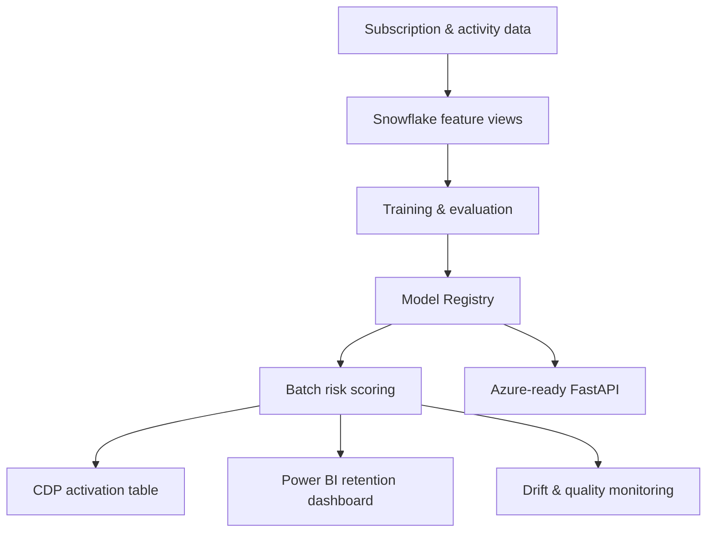

# Subscription Churn Risk Intelligence

[](https://github.com/lipsapriyadarsinee101-oss/subscription-churn-risk-intelligence/actions/workflows/ci.yml)
[](https://python.org)
[](https://www.snowflake.com/)
[](https://azure.microsoft.com/)

An end-to-end customer retention platform that predicts subscription cancellation, estimates Customer Lifetime Value (CLV), assigns member-level risk cohorts, and exports activation-ready records for a Customer Data Platform (CDP) and Power BI.

**Built by [Lipsa Priyadarsinee](https://github.com/lipsapriyadarsinee101-oss)** as a production-focused Data Science portfolio project.

## Business outcome

Instead of returning only a model probability, the system creates an actionable decision layer: who is at risk, why, their value, what intervention is recommended, and when the score was produced.

## Architecture



## Capabilities

- Reproducible synthetic subscription data generator
- Leakage-aware temporal train/test split
- Churn classification with preprocessing and probability calibration
- CLV estimation from monthly revenue, margin, tenure and survival probability
- High/medium/low risk cohorts with recommended retention actions
- Global and member-level churn-driver explanations
- Snowflake SQL feature layer and Snowpark Model Registry deployment example
- CDP- and Power BI-ready scoring contracts
- FastAPI real-time scoring endpoint
- Population Stability Index (PSI) drift monitoring
- Automated tests, Docker and GitHub Actions CI
- Technical runbook, model card and business handover guide

## Quick start

```bash
git clone https://github.com/lipsapriyadarsinee101-oss/subscription-churn-risk-intelligence.git
cd subscription-churn-risk-intelligence
python -m venv .venv
source .venv/bin/activate  # Windows: .venv\Scripts\activate
pip install -r requirements.txt
python -m src.data.generate --rows 5000
python -m src.training.train
streamlit run dashboard.py
```

Start the prediction API with:

```bash
uvicorn src.api.main:app --reload
```

Interactive API documentation: `http://localhost:8000/docs`.

## Example business output

| member_id | churn_probability | risk_cohort | predicted_clv | recommended_action |
|---|---:|---|---:|---|
| M000184 | 0.82 | HIGH | €428 | Priority outreach + tailored offer |
| M002931 | 0.47 | MEDIUM | €816 | Engagement campaign |
| M001207 | 0.11 | LOW | €1,240 | Loyalty reinforcement |

## Project structure

```text
src/data/          Synthetic data and validation
src/features/      Shared feature engineering and CLV
src/training/      Model training, evaluation and artifacts
src/scoring/       Cohorts, explanations and CDP export
src/monitoring/    Drift monitoring
src/api/           Real-time FastAPI service
snowflake/         SQL feature views and Snowpark deployment
docs/              Model card, runbook and business handover
tests/             Unit and integration tests
```

## Snowflake production path

The local pipeline mirrors a Snowflake-native design. `snowflake/01_feature_pipeline.sql` defines the member feature layer and activation table. `snowflake/02_train_register.py` shows how to train with Snowpark ML and register the model for governed inference. Feature freshness and point-in-time correctness should be managed through Snowflake Feature Store; versions, metrics and inference through Model Registry.

References: [Snowflake Feature Store](https://docs.snowflake.com/en/developer-guide/snowflake-ml/feature-store/overview), [Model Registry](https://docs.snowflake.com/en/developer-guide/snowflake-ml/model-registry/overview), [Classification ML Function](https://docs.snowflake.com/en/user-guide/ml-functions/classification).

## Evaluation and tests

```bash
pytest -q
python -m src.monitoring.drift
```

The training job writes ROC-AUC, PR-AUC, recall, precision, F1, Brier score and confusion-matrix values to `artifacts/metrics.json`. Production thresholds should be selected with business stakeholders based on retention capacity and intervention economics—not accuracy alone.

## Responsible modelling

- No post-cancellation fields are used as predictors.
- Temporal splitting simulates future production behaviour.
- Probability quality is measured because scores drive prioritisation.
- The API rejects invalid values through typed contracts.
- Predictions include a model version and scoring timestamp.
- Cohorts support human action; they do not make irreversible decisions.

## License

MIT

